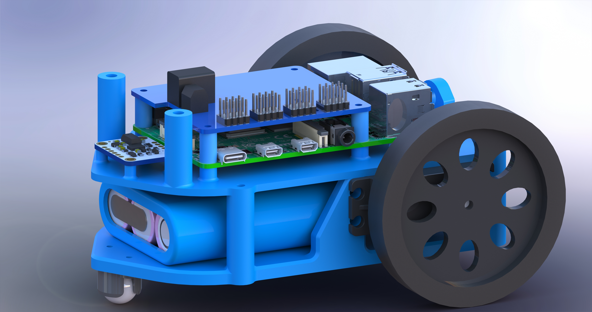

Differential Drive Robot
====================

My custom sensor and control library
---------------------

I created a sensor and control library to control a differential drive robot I created.
The differential robot is called Frank btw.

## Here is frank

## Issue tracking
- [x] Build and design Frank
- [x] Create repository and readme
- [x] Fix venv (no python exe?)
- [x] Fix repository basically
- [x] Learn python hardware interface
- [ ] Fix python library dependencies (Must be an easy way to download all relevant python libs)
- [ ] Finish sensor interface
- [ ] Finish Actuator interface
- [ ] Add threading to PID class
- [x] Investigate custom Kalman filter
- [ ] Write custom Kalman filter
- [ ] Get robot to turn accurately 90 Deg back and forth
- [x] Research A* algorithm
- [x] Create node map with localized resolution control
- [ ] Write A* algorithm for this map
- [ ] Translate path data into something followable
- [ ] Create path following controller (Pure pursuit maybe?)
- [ ] Get robot from point A to point B
- [ ] Get robot from point A to point B over a ~12 foot non-linear length within +- 1in
- [x] And do these always keeping in mind comments and readability for when I inevitably forget most of it
